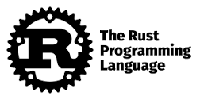

# mythos-rust-demo


A demo to run a Rust application on Cloud Run


### Commands

#### Create new rust application

```
cargo new demo
```

#### Compile rust application

```
cargo run
```

#### Push to Container Registry

```
gcloud builds submit --tag gcr.io/core-demos/demo --timeout=2000
```

#### Enable Container Registry caching

```
gcloud config set builds/use_kaniko True
gcloud config set builds/kaniko_cache_ttl 180
gcloud config list
```

#### Deploy to CloudRun
```
gcloud run deploy cloud-run-actix-hello --project core-demos --image gcr.io/core-demos/cloud-run-actix-hello --platform managed --region us-central1 --port 8080 --cpu 1 --memory 512Mi --concurrency 80 --timeout 300 --service-account 919060000353-compute@developer.gserviceaccount.com --clear-env-vars
```
